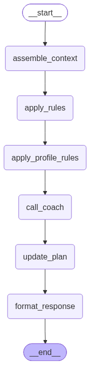
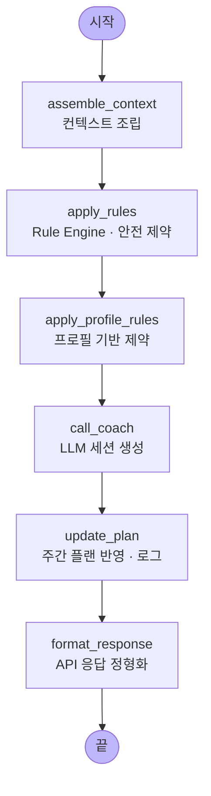

# 런시스턴트 (Runssistant)

러닝을 시작하는 건 쉽지만, 잘 뛰는 건 어렵습니다.
오늘 몇 km를 뛰어야 하는지, 이지런과 인터벌을 어떻게 섞어야 하는지, 대회 전에 훈련량을 얼마나 줄여야 하는지 — 혼자서 판단하기엔 막막한 것들이 많습니다.

런시스턴트(Runssistant)는 AI가 나의 체력, 컨디션, 목표를 분석해 오늘의 러닝을 추천하는 코칭 서비스입니다.
초보 러너부터 상급 러너까지, 기록하고 코칭받으며 체계적으로 성장할 수 있습니다.

핵심 흐름은 단순합니다 — 사용자가 러닝 기록과 목표를 입력하면,
`POST /coach/recommend`가 **주간 볼륨·최근 러닝·사용자의 프로필·현재 날씨**를 근거로
오늘의 세션(이지런 / 인터벌 / 템포런 / 장거리 / 휴식)을 AI로 추천합니다.

안전은 **코드로 결정론적으로 강제**합니다. LLM 호출 이전에 Rule Engine이
볼륨 가드·회복·테이퍼·폭염/한파·부상 위험 등 하드 제약을 먼저 계산하고,
LLM은 그 제약 *안에서* 세션 디테일과 동기 부여만 채웁니다.

> 프론트엔드는 별도 저장소(`com.runssistant.io`)에 있습니다.

---

## 기술 스택

| 레이어      | 선택                                | 이유                                      |
|-------------|-------------------------------------|-------------------------------------------|
| Framework   | FastAPI + uvicorn                   | LangGraph과 같은 Python, async 네이티브   |
| AI 엔진     | LangGraph + LLM provider 추상화     | 로컬(Ollama) ↔ Bedrock ↔ OpenAI 교체 가능 |
| Database    | PostgreSQL 15 (SQLAlchemy 2.x async)| JSONB로 유연한 스키마                     |
| Migration   | Alembic                             | SQLAlchemy 기반 마이그레이션              |
| Cache       | Redis 7                             | 날씨 캐시(30분), rate limit               |
| Weather     | OpenWeatherMap (free tier)          | 러닝 기록에 날씨 자동 스탬프              |
| Auth        | JWT (python-jose + bcrypt)          | 사이드 프로젝트 수준, 간단하게            |
| 패키지 관리 | uv                                  | 빠른 의존성 해석 / 잠금                   |
| 품질        | ruff + mypy(strict) + pytest        | 포맷·린트·타입·테스트                     |
| 배포 대상   | AWS Lambda + API Gateway (Mangum)   | 비용 최소화 (Sprint 4)                    |

로컬 개발은 무료·빠른 **Ollama**로, 프로덕션은 환경 변수 하나(`LLM_PROVIDER`)만
바꿔 **Bedrock**으로 전환합니다 — 코드 변경 없음.

---

## 아키텍처

엄격한 레이어 흐름. HTTP 요청은 **api → services → repositories → models** 순으로
내려가며, 각 레이어는 바로 아래 레이어만 호출합니다.

```
app/
├── api/           # 라우트: auth, runs, goals, plans, coach, stats
├── services/      # 비즈니스 로직 (run/goal/plan/weather/stats/coach)
├── repositories/  # 데이터 접근 (SQLAlchemy)
├── models/        # ORM 모델
├── schemas/       # Pydantic 요청/응답 DTO
├── core/          # config, security, exceptions, pace, redis
├── llm/           # LLM provider 추상화 (ollama / bedrock / openai)
└── graph/         # LangGraph 코칭 엔진
```

---

## 코칭 그래프 (LangGraph)

`build_coach_graph()` (`app/graph/coach_graph.py`)는 아래의 **선형 파이프라인**을
컴파일합니다. 각 노드는 상태(`CoachState`)를 받아 일부 필드를 갱신하고 다음
노드로 넘깁니다.

<p align="center">
  
</p>

> 위 이미지는 컴파일된 그래프를
> `build_coach_graph(llm).get_graph().draw_mermaid_png()`로 렌더링한 것입니다.
> 그래프 구조가 바뀌면 같은 명령으로 다시 생성하세요.



| 순서 | 노드 | 역할 |
|------|------|------|
| 1 | **assemble_context** | 사용자의 주간 볼륨·최근 러닝·목표·현재 날씨·오늘 가용 여부를 모아 코칭 컨텍스트를 조립 |
| 2 | **apply_rules** | Rule Engine. 볼륨 가드·회복·테이퍼·폭염/한파·부상 위험 등 **하드 제약을 결정론적으로 계산** (LLM 이전) |
| 3 | **apply_profile_rules** | 러너 프로필(경력·주간 목표 등) 기반 추가 제약을 적용 |
| 4 | **call_coach** | 제약 *안에서* LLM이 세션 상세와 동기 부여를 채워 정해진 JSON 형태로 생성 |
| 5 | **update_plan** | 주간 플랜 변경을 반영하고 `coaching_sessions` 로그를 기록 |
| 6 | **format_response** | 최종 API 응답 페이로드로 정형화 |

**Rule Engine이 LLM보다 먼저 실행되는 것은 설계 의도**입니다. 안전은 코드에서
결정론적으로 강제하고, LLM은 그 제약을 넘지 못합니다. 안전 로직을 프롬프트로
옮기지 마세요.

---

## 요구 사항

- **Python 3.11+**
- **Docker** + Docker Compose (로컬 PostgreSQL / Redis)
- **[uv](https://docs.astral.sh/uv/)** (권장) 또는 pip
- **[Ollama](https://ollama.com/)** (로컬 LLM 실행용, 선택)
- **OpenWeatherMap API 키** (날씨 연동용)

---

## 설치 및 실행

### 1. 인프라 기동

```bash
docker-compose up -d          # PostgreSQL 15 + Redis 7
```

### 2. 의존성 설치

```bash
uv sync                        # 또는: pip install -e ".[dev]"
```

### 3. 환경 변수 설정

```bash
cp .env.example .env
```

`.env`에서 최소한 아래 값을 채웁니다.

| 변수              | 설명                                    | 예시 / 기본값                   |
|-------------------|-----------------------------------------|---------------------------------|
| `DATABASE_URL`    | PostgreSQL 접속 URL (asyncpg)            | `postgresql+asyncpg://...`      |
| `REDIS_URL`       | Redis 접속 URL                          | `redis://localhost:6379`        |
| `JWT_SECRET_KEY`  | JWT 서명 키 (**긴 랜덤 문자열 필수**)   | —                               |
| `LLM_PROVIDER`    | `ollama` \| `bedrock` \| `openai`       | `ollama`                        |
| `OLLAMA_MODEL`    | 로컬 모델 이름                          | `gemma3:4b`                     |
| `OWM_API_KEY`     | OpenWeatherMap API 키                   | —                               |

### 4. 로컬 LLM 준비 (Ollama 사용 시)

```bash
ollama pull gemma3:4b
```

### 5. DB 마이그레이션

```bash
alembic upgrade head
```

### 6. 개발 서버 실행

```bash
uvicorn app.main:app --reload --port 8000
```

- Health check: <http://localhost:8000/health>
- API 문서 (Swagger UI): <http://localhost:8000/docs>

---

## API 개요

| 그룹    | 엔드포인트                                                            |
|---------|-----------------------------------------------------------------------|
| auth    | `POST /auth/signup` · `POST /auth/login` · `GET /auth/me`             |
| runs    | `POST/GET /runs` · `GET/PUT/DELETE /runs/{id}`                        |
| stats   | `GET /stats/weekly` · `GET /stats/trend` · `GET /stats/personal-bests`|
| goals   | `POST/GET/PUT /goals` · `GET /goals/active` · `PATCH /goals/{id}/status` |
| plans   | `GET /plans/current` · `GET /plans/history` · `GET /plans/{week_start}` |
| coach   | `POST /coach/recommend` · `POST /coach/feedback` · `GET /coach/history` |

모든 에러는 통일된 엔벨로프로 응답합니다:
`{"error": {"code", "message", "details"}}`

---

## 개발 명령어

```bash
pytest -v                        # 전체 테스트
pytest tests/test_coach.py       # 파일 단위
ruff format . && ruff check .    # 포맷 + 린트
mypy app                         # 타입 체크
alembic revision --autogenerate -m "msg"   # 마이그레이션 생성
```

---

## 배포

**대상 환경: AWS Lambda + API Gateway** (Mangum 어댑터).
서버리스로 상시 비용을 최소화하는 사이드 프로젝트 구성입니다.

- **DB**: Amazon RDS (PostgreSQL, free tier)
- **Cache**: Amazon ElastiCache (Redis) 또는 인메모리
- **LLM**: Amazon Bedrock (`LLM_PROVIDER=bedrock`, 예: `amazon.nova-lite-v1:0`)
- **Weather**: OpenWeatherMap free tier

Lambda 패키징/배포는 **Sprint 4**에서 정식화됩니다 — 진행 현황은
[CHANGELOG.md](./CHANGELOG.md)를 확인하세요.

---

## 문서

- **[CHANGELOG.md](./CHANGELOG.md)** — 버전별 변경 이력 (버전 관리)
